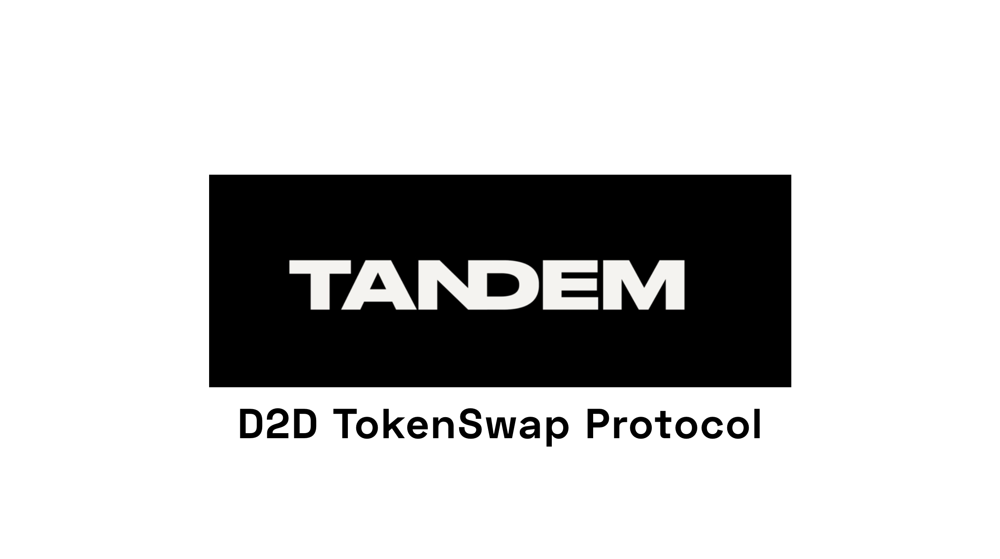

<p align='center'>
  Welcome to Tandem DAO git repository. <br/><br/>
   
</p>

<details>
  <summary> Git flow </summary>
  
This is our [git flow](FLOW.md)
</details>

<details>
  <summary> Usage </summary>

First install dependencies:

```shell
yarn install
```

### Compile

Compile smart contracts with hardhat compile:

```shell
$ yarn compile
```

### Lint

Actually run lint:sol and prettier. Lint solidity code:

```shell
$ yarn lint
```

### Test

Run the Mocha/Chai tests:

```shell
$ yarn test
```

### Hardhat Commands

```shell
npx hardhat accounts
npx hardhat compile
npx hardhat clean
npx hardhat test
npx hardhat node
node scripts/sample-script.js
npx hardhat help
```

</details>

<details>
  <summary> Roadmap  </summary>

- (wip)
</details>
